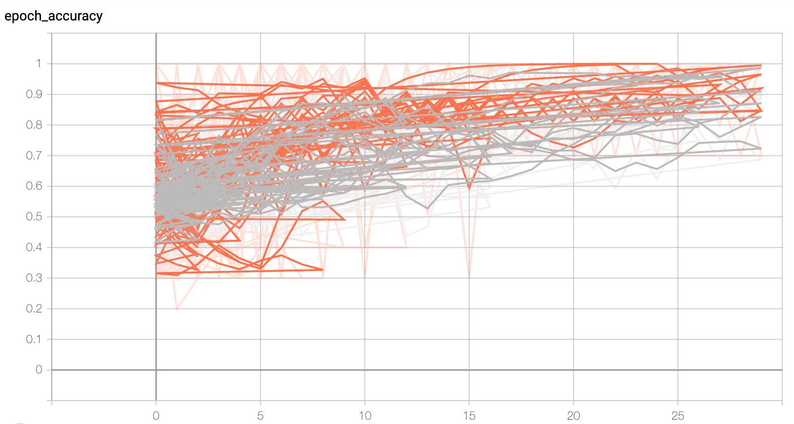
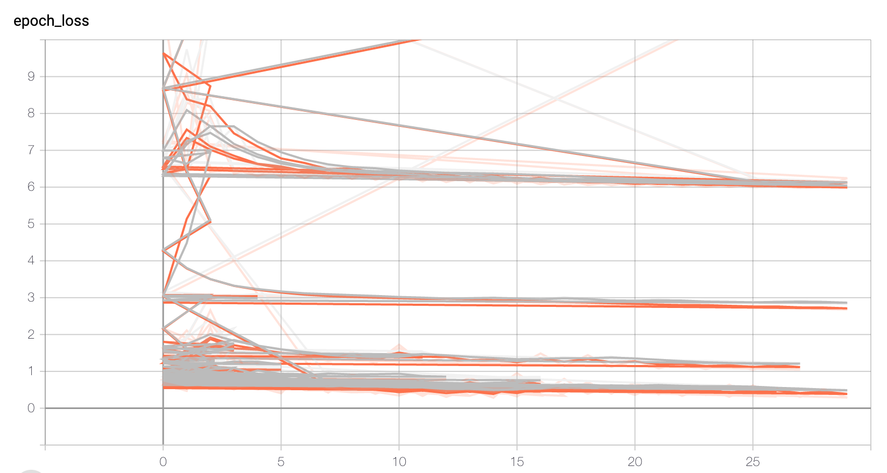

# COVID-19 Detection
  - Deep Neural Network to detect COVID-19 using chest X-ray images
  - Developer: Sujan Dhakal
 
Machine Learned Models have been powerful in detecting tumors and cancers. So, I decided to develop a model that can detect if a patient has COVID-19 or not based on the chest X-ray images.

(Note: This is only for educational purpose. DO NOT use it as reference for medical purpose.)

Image Dataset:
    
    https://github.com/ieee8023/covid-chestxray-dataset
    https://www.kaggle.com/paultimothymooney/chest-xray-pneumonia
    https://www.pyimagesearch.com/2020/03/16/detecting-covid-19-in-x-ray-images-with-keras-tensorflow-and-deep-learning/

Normal Chest X-ray Images: 25

COVID-19 Chest X-ray Images: 25

After hyperparameter tuning, the folowing model was achieved. The model is saved as 'model.h5'.

Model Performance:

    • Training Set    -   Accuracy: 75.0000%    &    Loss: 0.4946
    • Validation Set  -   Accuracy: 100.0000%   &    Loss: 0.2829
    • Testing Set     -   Accuracy: 90.0000%    &    Loss: 0.3702

Accuracy Graph

Loss Graph

